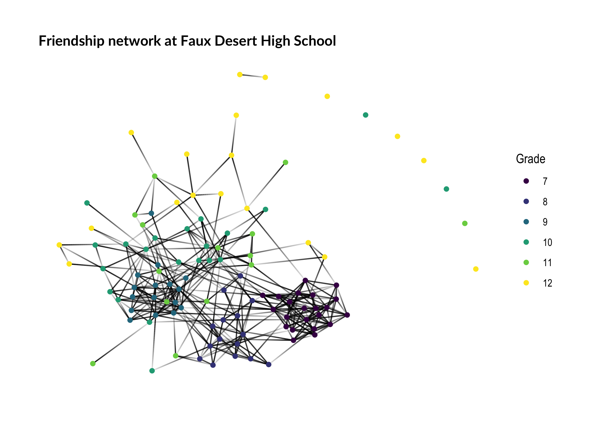
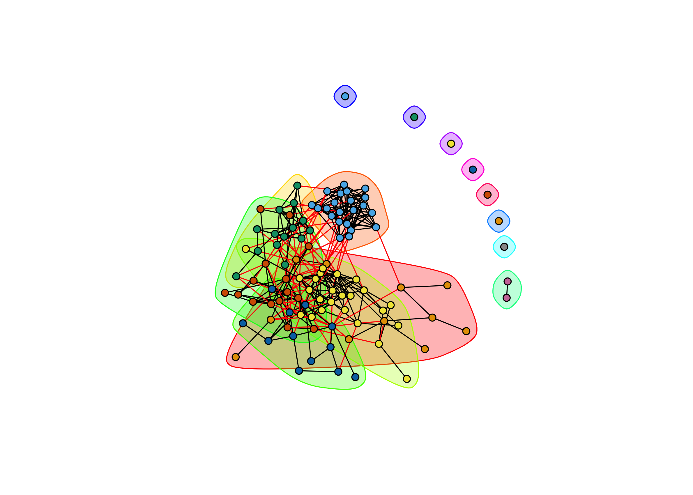
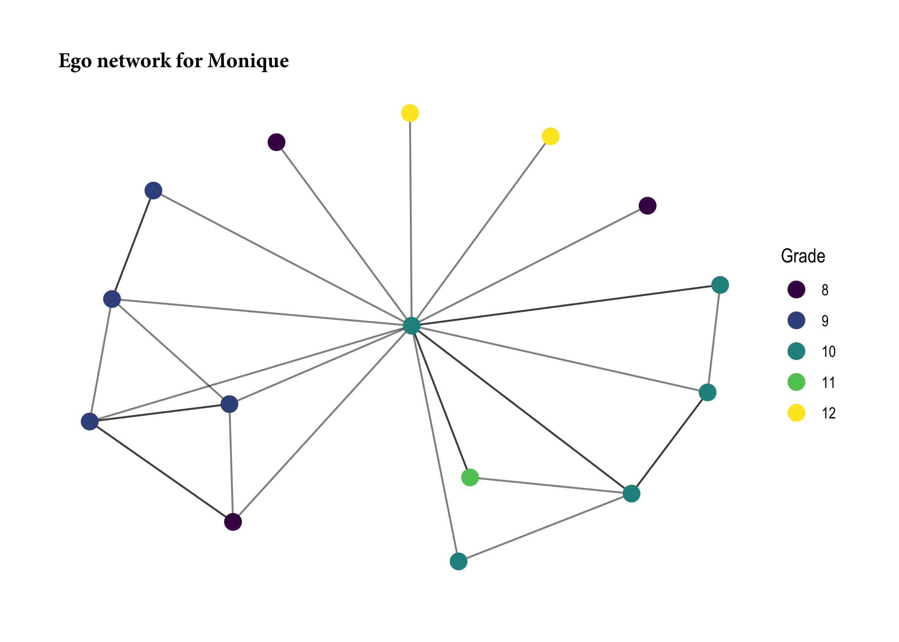
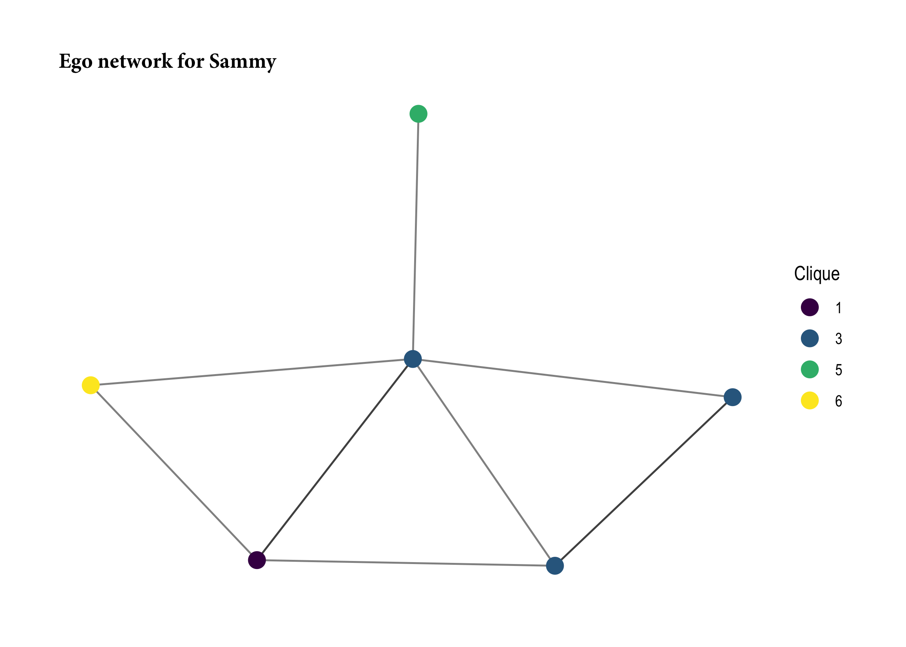
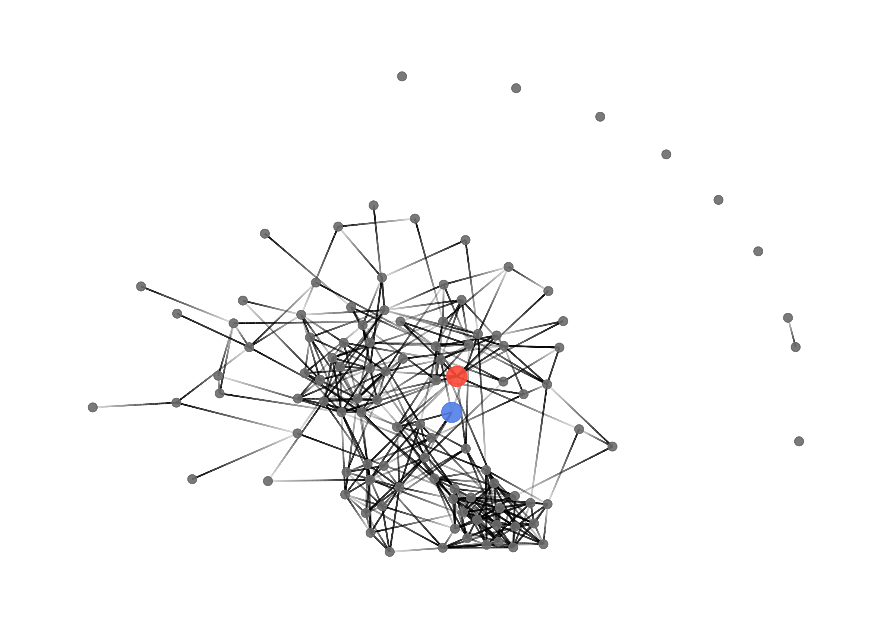
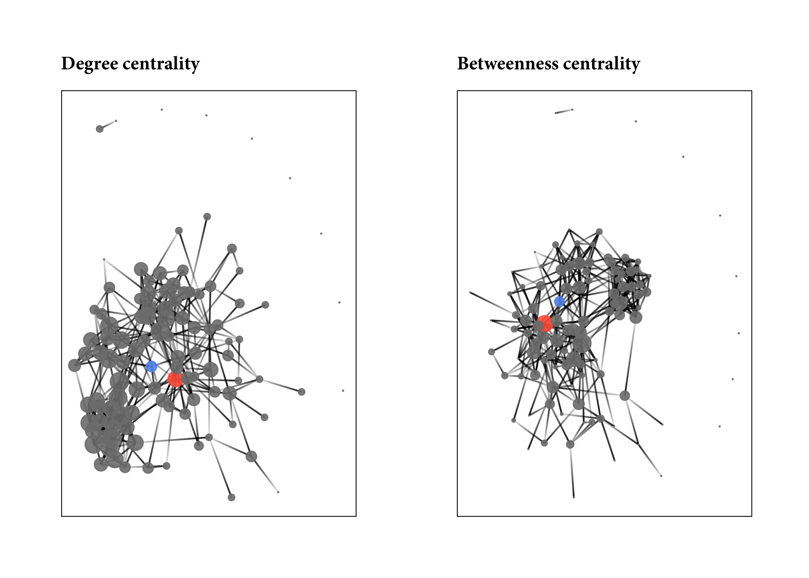

# R function for network range
Richard Paquin Morel  


## Network Range

This function calculates **network range**, as described by Burt (1981) and implemented by Reagans and McEvil (2003). **Network range** is a node-level measure of the diversity of an ego's network connections. It is a function of two features of an ego's network: first, how they distribute their connections across a range of subgroups; and second, how strongly connected those subgroups are. The main idea here is that a person has a wide ranging network if they distribute their connections widely across various subgroups _and_ those subgroups are more loosely connected. It is helpful is this context to think about these subgroups as constituting distinct knowledge pools--for example, departments in a university.

While the first point is pretty intuitive--you can access more diverise information if you are connected to more knowledge pools--the second is a bit less so. The idea is closely related to Ronald Burt's other work. Burt has argued that dense networks result in redundant information. If people within a group have strongly connected to one another, that means they talk to each other a lot. Think of a friendship network. If something interesting happened to one of my close friends, I'm likely to hear the story from them. But I'm also likely to hear the story from another friend who is close to both of us. The information that my friend and I have access to overlap significantly compared to two people who do not know each other well. So, Burt argues, in less dense networks, a greater proportion of the information a person is likely to encounter is novel. There is less redundant information. 

So back to range. If I am connected to people in several different departments, I have a very diverse knowledge pool I can draw from. Those knowledge pools are enhanced when they are more loosely connected, since more of the information that I can access is novel. 

To measure an actor's network range, it is necessary to calculate the diversity of their ties and the cohesiveness of the knowledge pools they are connected to. We measure the first but taking the sum of the ratio of the sum of the strength of an actor's connection to the distinct subgroups in the network to the sum of the strength of their overall connections (all equations based on Reagans & McEvily, 2003):

$$ p_{ik} = \sum_j^{N_k}z_{ij} / \sum_q^N z_{iq}$$
where $i$ represents the focal node, $j$ represents their connections within group $k$, and $q$ represents any of their connections. $N_k$ is the number of connections $i$ has in group $k$, while $N$ is the total number of connections person $i$ has. The terms $z_{ij}$ and $z_{iq}$ captures the strength of the tie between person $i$ and person $j$ and $q$. To put this plainly, we are summing person $i$'s ties within each distinct group and overall and then finding what proportion of the overall ties is represented by that group. So say that are 6 distinct groups in the network, each $i$ will have 6 scores after this calculation.

To calculate the cohesiveness of each group:

$$p_k = \sum_j^{M_k} x_{ij} / \sum_q^{S_k} x_{iq} $$

where $M_k$ is the number of nodes within group $k$ and $x_{ij}$ is the strength of connections between $i$ and another person in group $k$. $S_k$ is the total number of connections of nodes in group $k$ and $x_{iq}$ is the strength of connections between person $i$ and any other connection. To put plainly, this finds how strong connections are in group $k$ relative to the overall connections of people in group $k$.

So now we have the two parts we need to calculate the network diversity of each node in the network:

$$ d_i =  1 - \sum_k^{N_k} p_k p_{ik}^2 $$

To find the diveristy score of person $i$, we sum the product of $p_k$, the cohseiveness of group $k$ and the squared of $p_ik$--that is, $i$'s stregth of connections in group $k$. This is product is summed over $k$. Subtracting the summation from one makes the score more sensible, in that higher score indicate greater diversity.

Now that we have all the pieces, we can make this a bit more intuitive. A person's diversity score increases under two conditions: first, to the extent that the spread their connections across the groups in the network; and second, to the extent that the groups that are connected to are themselves more loosely connected internally.

Here is the function that I wrote to determine network range. It has three arguments: `net`, the network, which can be an adjacency matrix, a data frame, an `igraph` object, or a `network` object; `attr` which is a vector of attributes representing group membership; and the boolean `directed`, which indicates if the network is directed or not. It is important that the order of `attr` matches the order of nodes in the network--i.e. the first entry in the attribute vector should represent the group membership of the node in first row of the adjacency matrix, etc. 


```r
## Function to find network range for each node in a network
## Arguments:
##  net = adjacency matrix, igraph graph, or network object
##  attr = Vector of attributes associated with each node in net
##  directed = boolean indicated if the network is directed or not

netrange <- function(net, attr, directed = TRUE){
  require(reshape2)
  if (class(net) == "igraph") {
      net <- as_adjacency_matrix(net, sparse = F)
    }
  else {
    if(class(net) == "network") {
        net <- as.matrix.network(net)
      }
    else {
        net <- as.matrix(net)
      }
    }
  if(nrow(net) != length(attr)) {
    stop("Number of nodes must match length of attributes vector")
   }
  else {
    if (directed == TRUE){
      ns <- colnames(net)
      el <- melt(net, varnames=c("ego", "alter"), value.name = "weight")
      df <- cbind(rownames(net), attr)
      el$ego_grp <- df[match(el[,1], df[,1]), 2]
      el$alter_grp <- df[match(el[,2], df[,1]), 2]
      
      #FINDING p_k, the strength of ties within each group
      # z_iq = sum of strength of ties from nodes in group _k_ to all other alters
      # z_ij = sum of strength of ties from nodes in group _k_ to alters in group _k_
      
      z_iq <- sapply(unique(attr), function(x) {
        sum(el[which(el$ego_grp==x), "weight"])
      })
      z_ij <- sapply(unique(attr), function(x) {
        sum(el[which(el$ego_grp==x & el$alter_grp==x), "weight"])
      })
      p_k <- z_ij / z_iq
      p_k[is.na(p_k)] <- 0
      
      #FINDING p_ik, the strength of connection from person i to group k
      # x_iq = sum of strength of ties for _i_ to alters in group _k_
      # x_ij = sum of strength of ties for _i_ to all alters
      
      x_ij <- sapply(colnames(net), function(x) {
        sum(el[which(el$ego==x), "weight"])
      }
      )
      x_iq <- list(NULL)
      for(i in colnames(net)) {
        x_iq[[i]] <- sapply(unique(attr), function(x) {
          sum(el[which(el$ego==i & el$alter_grp==x), "weight"])
        }
        )
      }
      x_iq <- x_iq[-c(1)] #x_iq is now a list where each elements is a vector of node _i_ summed strength of tie to group _k_
      
      p_ik <- lapply(1:length(x_iq), 
                     function(x) x_iq[[x]] / x_ij[x])
      
      # FINDING nd_i, the network diversity score for node _i_
      
      nd_i <- sapply(1:length(p_ik), 
                     function(x) 1 - sum(p_k*p_ik[[x]]^2, na.rm = F)
      )
    }
    else {
    ns <- colnames(net)
    el <- melt(net, varnames=c("ego", "alter"), value.name = "weight")
    dup <- data.frame(t(apply(el[,1:2],1,sort)))
    el <- el[!duplicated(dup),]
    df <- cbind(rownames(net), attr)
    el$ego_grp <- df[match(el[,1], df[,1]), 2]
    el$alter_grp <- df[match(el[,2], df[,1]), 2]
    
    #FINDING p_k, the strength of ties within each group
    # z_iq = sum of strength of ties from nodes in group _k_ to all other alters
    # z_ij = sum of strength of ties from nodes in group _k_ to alters in group _k_
    
    z_iq <- sapply(unique(attr), function(x) {
      sum(el[which(el$ego_grp==x | el$alter_grp==x), "weight"])
    })
    z_ij <- sapply(unique(attr), function(x) {
      sum(el[which(el$ego_grp==x & el$alter_grp==x), "weight"])
    })
    p_k <- z_ij / z_iq
    p_k[is.na(p_k)] <- 0
    
    #FINDING p_ik, the strength of connection from person i to group k
    # x_iq = sum of strength of ties for _i_ to alters in group _k_
    # x_ij = sum of strength of ties for _i_ to all alters
    
    x_ij <- sapply(colnames(net), function(x) {
      sum(el[which(el$ego==x | el$alter==x), "weight"])
    }
    )
    x_iq <- list(NULL)
    for(i in colnames(net)) {
      x_iq[[i]] <- sapply(unique(attr), function(x) {
        sum(el[which(el$ego==i & el$alter_grp==x), "weight"],
            el[which(el$alter==i & el$ego_grp==x), "weight"])
      }
      )
    }
    x_iq <- x_iq[-c(1)] #x_iq is now a list where each elements is a vector of node _i_ summed strength of tie to group _k_
    
    p_ik <- lapply(1:length(x_iq), 
                   function(x) x_iq[[x]] / x_ij[x])
    
    
    # FINDING nd_i, the network diversity score for node _i_
    
    nd_i <- sapply(1:length(p_ik), 
                   function(x) 1 - sum(p_k*p_ik[[x]]^2, na.rm = F)
    )
    }
    return(nd_i)
  }
}
```

## An example: Who's got the best gossip?

To illustrate this, I will use an example dataset from Hancock et al.'s (2003): A mock social network in a fake high school (Magnolia High). This is a simulated network based on exponential random graph model fits of actual high school networks from the AddHealth data set (Resnick et al, 1997). Now, normally you might think that range is most useful for organizations involved in complex work that draws on multiple knowledge domains (as is the case in Reagans & McEvily). But it may be relevant to the social lives of teenagers as well. Hear me out on this one. If a junior in Magnolia High has friends in each of the grades and several cliques, she potentially has strong access to that most valuable of high school resources: gossip. Knowing who is doing what in each grade and each clique arms her with powerful information to control the social life of the high school!

Let's take a look at Magnolia High.


```r
library(statnet) #The statnet suite of packages contains the sna, network, and ergm (home of the Magnolia High network) packages.
data(faux.desert.high)
summary(faux.desert.high, print.adj = F, mixingmatrices = T)
```

```
## Network attributes:
##   vertices = 107
##   directed = TRUE
##   hyper = FALSE
##   loops = FALSE
##   multiple = FALSE
##   bipartite = FALSE
##   title = comm6.net
##  total edges = 439 
##    missing edges = 0 
##    non-missing edges = 439 
##  density = 0.0387057 
## 
## Vertex attributes:
## 
##  grade:
##    integer valued attribute
##    107 values
## 
##  race:
##    character valued attribute
##    attribute summary:
##  A  B  H  O  W 
##  1  2  3  7 94 
##    mixing matrix:
##        To
## From    A B  H  O   W Total
##   A     0 0  0  0   0     0
##   B     0 0  0  0   4     4
##   H     0 0  1  0  13    14
##   O     0 0  0  2  18    20
##   W     0 7 13 17 364   401
##   Total 0 7 14 19 399   439
## 
##  scode:
##    integer valued attribute
##    107 values
## 
##  sex:
##    integer valued attribute
##    107 values
##   vertex.names:
##    character valued attribute
##    107 valid vertex names
## 
## No edge attributes
```

Let's plot it, coloring the nodes by grade level.


<!-- -->

We some some clustering by grade, particularly in grade 7. Not surprising that the smallest fish in the pond stick together. Grade 12 seems much more spread out. In addition to the formal grouping of grades, we can also find informal cliques within the school using a community detection algorithm. There are ample options to choose from in the network analysis world. Personally, I like the fast-greedy method used by Clauset et al. (2004), but it is only defined for undirected networks. No worries; we will fudge here and treat the network as undirected when finding subgroups. It assigns each node in the network to a distinct subgroup based on the density of ties in that subgroup. Unfortunately, it is not available in the `sna` package, so we have to turn to `igraph`. That means we need to convert our network from a `network` object to an `igraph` object. No worries there thanks to the Michal Bojanowski's `intergraph` package! It even transfers attribute information!


```r
g_desert <- intergraph::asIgraph(faux.desert.high)
g_desert
```

```
## IGRAPH D--- 107 439 -- 
## + attr: title (g/c), grade (v/n), na (v/l), race (v/c), scode
## | (v/n), sex (v/n), vertex.names (v/c), na (e/l)
## + edges:
##  [1]  1-> 58  1-> 74  1-> 81  1->105  3-> 30  3-> 32  3-> 87  3->101
##  [9]  4-> 13  4-> 75  5->106  6-> 60  7-> 15  7-> 19  7-> 39  7-> 40
## [17]  7-> 45  7-> 48  7-> 50  7-> 52  7-> 54  7-> 70  7->103  8-> 11
## [25]  8-> 28  8-> 36  8-> 60 10->  1 12->  3 12->  7 12-> 34 12-> 40
## [33] 12-> 50 12-> 68 12-> 89 12-> 91 12-> 99 12->101 13->  9 13-> 17
## [41] 13-> 25 13-> 37 13-> 41 13-> 70 13-> 72 13-> 90 13->101 13->104
## [49] 14-> 70 14-> 72 15->  7 15-> 24 15-> 39 15-> 50 15-> 54 15-> 83
## + ... omitted several edges
```

Now that we have our `igraph` object, we can use `cluster_fast_greedy` to determine subgroups and add those to our `network` object as attributes. The function produces a many pieces of information; we are interested in the groups membership object, which we can assign directly to the `network` object as an attribute, which I will call `cliques`. I prefer not to load `igraph` when using `sna` and `network`, because they don't play well together. So I will preface calls to `igraph` functions with `igraph::`. 


```r
g_desert <- igraph::as.undirected(g_desert)
faux.desert.high %v% "cliques" <- igraph::cluster_fast_greedy(g_desert)$membership
mixingmatrix(faux.desert.high, "cliques")
```

```
##        To
## From     1   2  3   4  5  6 7 8 9 10 11 12 13 14 Total
##   1     11   2  4   1  2  1 0 0 0  0  0  0  0  0    21
##   2      4 140  4   1  1  5 0 0 0  0  0  0  0  0   155
##   3      3   4 50   3  1  3 0 0 0  0  0  0  0  0    64
##   4      4   4  9  80  4  4 0 0 0  0  0  0  0  0   105
##   5      0   0  2   9 18  4 0 0 0  0  0  0  0  0    33
##   6      4   1  4   7  2 42 0 0 0  0  0  0  0  0    60
##   7      0   0  0   0  0  0 1 0 0  0  0  0  0  0     1
##   8      0   0  0   0  0  0 0 0 0  0  0  0  0  0     0
##   9      0   0  0   0  0  0 0 0 0  0  0  0  0  0     0
##   10     0   0  0   0  0  0 0 0 0  0  0  0  0  0     0
##   11     0   0  0   0  0  0 0 0 0  0  0  0  0  0     0
##   12     0   0  0   0  0  0 0 0 0  0  0  0  0  0     0
##   13     0   0  0   0  0  0 0 0 0  0  0  0  0  0     0
##   14     0   0  0   0  0  0 0 0 0  0  0  0  0  0     0
##   Total 26 151 73 101 28 59 1 0 0  0  0  0  0  0   439
```

The mixing matrix shows us that there are 14 distinct subgroups, but 7 of them are just isolate nodes--those poor students with no friends and one consist of just one friendship tie. Hey, at least they have each other. Of the remaining 6, we can see by looking down the diagonal that most ties are within clique, but not exclusively. Looks like our algorithm did a nice job.

`igraph` has a nice ploting function that goes along with its community detection functions. For this, I'll go ahead and load `igraph`.


```r
library(igraph)
fg <- cluster_fast_greedy(g_desert)
plot(fg, g_desert,
     vertex.color = V(g_desert)$colors,
     vertex.label = NA, 
     vertex.size = 5)
```

<!-- -->

```r
detach("package:igraph", unload=TRUE)
```

We can see distinct clustering by grade-level, but also a lot of overlap between thr groups. So these cliques are distinct, but not the dominant mode of social organziation in the school.

## Network Range of High School Students

Now that we have found informal cliques in the school, let's use the network range function to find network diversity based on (1) grade-level membership and (2) clique membership. 

First, for grade level membership, we pass the `network` object `faux.desert.high`, the grade attribute, and set directed to `TRUE`:


```r
range_grade <- netrange(faux.desert.high, 
               faux.desert.high %v% "grade", 
               directed = T)
```

```
## Loading required package: reshape2
```


```r
range_clique <- netrange(faux.desert.high, 
               faux.desert.high %v% "cliques", 
               directed = T)
```


```r
library(dplyr)
desert_attr <- data.frame(node = faux.desert.high %v% "vertex.names",
                          grade = faux.desert.high %v% "grade",
                          clique = faux.desert.high %v% "cliques",
                          range_grade = range_grade,
                          range_clique = range_clique,
                          stringsAsFactors = F)
desert_attr %>% 
  group_by(grade) %>% 
  summarize(mean_grade_range = mean(range_grade, na.rm = T),
            mean_clique_range = mean(range_clique, na.rm = T)
  )
```

```
## # A tibble: 6 x 3
##   grade mean_grade_range mean_clique_range
##   <int>            <dbl>             <dbl>
## 1     7        0.2385250         0.2417038
## 2     8        0.4469988         0.5000626
## 3     9        0.4970653         0.4214951
## 4    10        0.7057428         0.6085711
## 5    11        0.6204028         0.4475440
## 6    12        0.4821193         0.4102803
```

Now for the most critical question: _who's got the best gossip?_


```r
head(desert_attr[order(desert_attr$range_grade, decreasing = T), c("node", "grade", "range_grade")])
```

```
##     node grade range_grade
## 13    13    10   0.8458637
## 31    31    12   0.8294372
## 61    61    10   0.8273987
## 58    58    10   0.8160005
## 104  108    11   0.8135405
## 49    49    11   0.8078238
```

For diveristy across grade levels, student 13 has the maximum range score, with several others close behind. These students spread their social connections across different grades, and so are privy to all the rumors and machinations specific to each grade. It is interesting that 5 of the students with the top 6 score in the middle secondary grades--sophomores and juniors. Conceiveably, students in these grades may benefit the most from access to diverse social information. They are right in the heart of high school, unlike the one-foot-out-the-door seniors or the deer-in-the-headlights freshman. 

I'm curious now about the means and standard deviations of range scores by grade-level. The `dplyr` package is handy for quickly summarizing data. Grouping the data with `group_by` and then using `summarize` we can quickly see these summary stats by group--but remember to remove _NA_ values when finding `mean` and `sd`!


```r
desert_attr %>%  
  group_by(grade) %>% 
  summarize(mean_range_grade = mean(range_grade, na.rm = T),
            sd_range_grade = sd(range_grade, na.rm = T))
```

```
## # A tibble: 6 x 3
##   grade mean_range_grade sd_range_grade
##   <int>            <dbl>          <dbl>
## 1     7        0.2385250      0.1442056
## 2     8        0.4469988      0.1786904
## 3     9        0.4970653      0.1933338
## 4    10        0.7057428      0.1450669
## 5    11        0.6204028      0.2225077
## 6    12        0.4821193      0.1640451
```

As we suspected, sophmores and junior have the greatest mean diversity scores in the school.

So sophomores and juniors are actively making friendship ties across all grade level, giving them access to all the best grade-level gossip. But are they also plugged into the dominant cliques across the school?


```r
head(desert_attr[order(desert_attr$range_clique, decreasing = T), c("node", "grade", "clique")])
```

```
##     node grade clique
## 71    73     8      3
## 58    58    10      4
## 13    13    10      6
## 87    90    11      5
## 105  109    10      5
## 37    37     8      1
```

Again, sophomores and juniors are represented in the top six max range scores. But this time we have two freshman represented as well. Inspecting means by grade, we see that sophomores and juniors still, on average, have greater network range compared to other grades. Those two freshman must be socially precocious compared to their grade-level peers.


```r
desert_attr %>%  
  group_by(grade) %>% 
  summarize(mean_range_grade = mean(range_grade, na.rm = T),
            sd_range_grade = sd(range_grade, na.rm = T))
```

```
## # A tibble: 6 x 3
##   grade mean_range_grade sd_range_grade
##   <int>            <dbl>          <dbl>
## 1     7        0.2385250      0.1442056
## 2     8        0.4469988      0.1786904
## 3     9        0.4970653      0.1933338
## 4    10        0.7057428      0.1450669
## 5    11        0.6204028      0.2225077
## 6    12        0.4821193      0.1640451
```

```r
desert_attr %>%  
  filter(clique < 7) %>% 
  group_by(clique) %>% 
  summarize(mean_range_grade = mean(range_grade, na.rm = T),
            sd_range_grade = sd(range_grade, na.rm = T),
            clique_size = n())
```

```
## # A tibble: 6 x 4
##   clique mean_range_grade sd_range_grade clique_size
##    <dbl>            <dbl>          <dbl>       <int>
## 1      1        0.5524458      0.1852179          11
## 2      2        0.2385250      0.1442056          22
## 3      3        0.4303400      0.1729193          14
## 4      4        0.5119731      0.2097067          24
## 5      5        0.6663146      0.1329179          12
## 6      6        0.6788095      0.1904140          15
```

Inspecting means by clique (excluding cliques with two or fewer members), there isn't as wide a range of mean range scores, with one clique being notable more insular than others. Clique 2, unsurprisingly, consists entirely of seventh graders, the youngest students in the school. Gotta stick together to survive.

Last, let's take a closer look at the rulers of Desert High's gossip mill, our friends #13 and #73. #13 had the largest formal network range score in the network. This student had friendship ties spread across different grades, which we can see by look at #13's ego network.


```r
ego13 <- ego.extract(faux.desert.high, 13, neighborhood = "combined")
gplot(ego13$`13`, 
      vertex.col = desert_attr[match(colnames(ego13$`13`), 
                                     desert_attr$node), 
                               "color"],
      edge.col = "grey40")
```

<!-- -->

(Note: I use the `gplot` function here rather than simply `plot` because the `ego.extract` function produces a matrix rather than a `network` object. Sending a matrix to `plot` does not produce a network graph, but `gplot` will convert the matrix to a network for us. Happy days.)

On the other hand, #73 has her or his finger on the pulse of the informal social order in the school. S/he (documentation does not provide a codebook for sex!) spreads her social ties across several social cliques.


```r
ego73 <- ego.extract(faux.desert.high, 71, neighborhood = "combined")
gplot(ego73$`73`, 
      vertex.col = desert_attr[match(colnames(ego73$`73`), 
                                     desert_attr$node), 
                               "clique"],
      edge.col = "grey40")
```

<!-- -->

Now, thinking about the larger social order of the high school, where are #13 and #73 located? Are they particularly popular? Are they brokers, mediating between friends?


```r
desert_attr <- desert_attr %>% 
  mutate(colors = c(rep("white",12), 
                    "red", 
                    rep("white",70-13),
                    "blue",
                    rep("white",nrow(desert_attr)-71)))
  
plot(faux.desert.high,
     vertex.col = desert_attr$colors,
     vertex.cex = c(rep(1,12), 
                    2, 
                    rep(1,70-13),
                    2,
                    rep(1,nrow(desert_attr)-71)),
     edge.col = "grey40",
     coord = l
)
```

<!-- -->


```r
par(mfrow=c(1,2), margin(0, 0, 0, 0))
plot(faux.desert.high,
     vertex.col = desert_attr$colors,
     vertex.cex = degree(faux.desert.high, cmode="indegree", rescale = T)*100,
     edge.col = "gray40",
     coord = l,
     main = "Degree centrality"
)

plot(faux.desert.high,
     vertex.col = desert_attr$colors,
     vertex.cex = betweenness(faux.desert.high, rescale=T)*70,
     edge.col = "gray40",
     coord = l,
     main = "Betweeness centrality"
)
```

<!-- -->

Visually, 


```r
library(ggplot2)
desert_attr <- desert_attr %>% 
  mutate(d_cent = degree(faux.desert.high, cmode="freeman"),
         b_cent = betweenness(faux.desert.high))

par(mfrow=c(1,2))
pdeg <- ggplot(desert_attr) +
  geom_density(aes(x = d_cent)) +
  geom_vline(xintercept = desert_attr[which(desert_attr$node == "13"), "d_cent"], linetype="dashed") +
  geom_vline(xintercept = desert_attr[which(desert_attr$node == "73"), "d_cent"], linetype="dotted")

pbtw <- ggplot(desert_attr) +
  geom_density(aes(x = b_cent)) +
  geom_vline(xintercept = desert_attr[which(desert_attr$node == "13"), "b_cent"], linetype="dashed") +
  geom_vline(xintercept = desert_attr[which(desert_attr$node == "73"), "b_cent"], linetype="dotted")

gridExtra::grid.arrange(pdeg, pbtw, ncol=2)
```

<!-- -->
